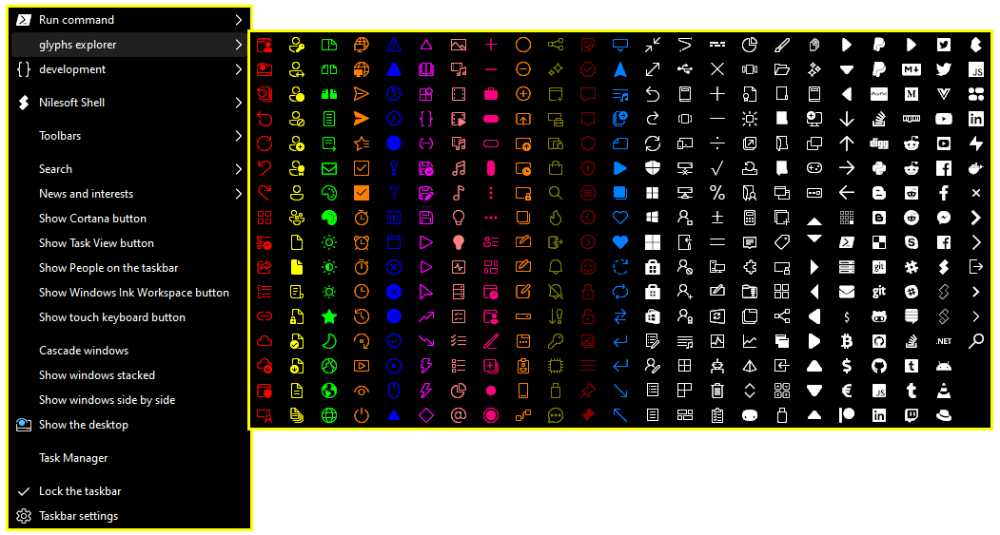
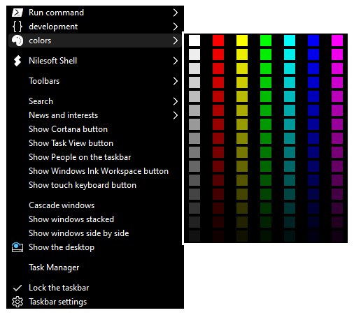
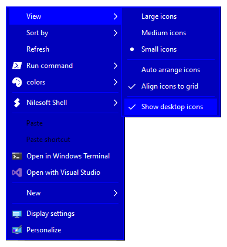
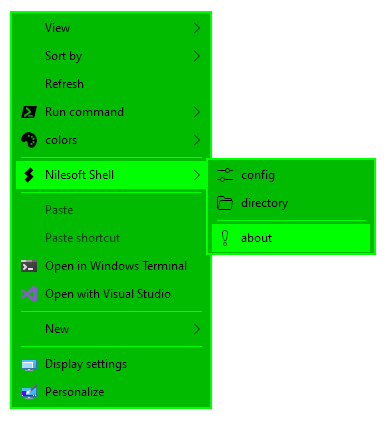
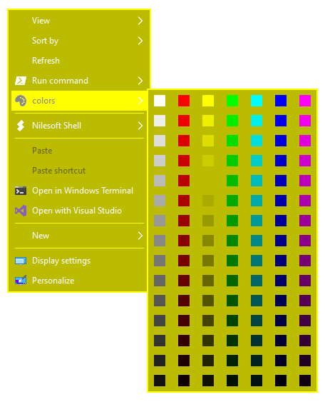
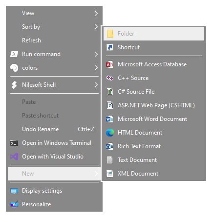
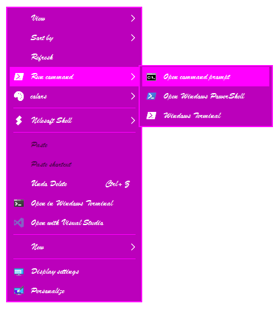
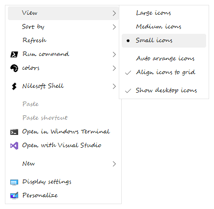

# [Shell](https://nilesoft.org)
**Shell** is a powerful context menu manager for Windows File Explorer.

 
  
  

Download the latest official version:  
https://nilesoft.org/download

Features
------------------
* Fully management of the context menu.
* Fully customize appearance.
* Adding new custom menu items such as submenu (cascaded menus), menuitem and separator.
* Modify regular menu items added by system or third-party.
* Support all file system objects files, folders, desktop and taskbar.
* Support expressions syntax.
* Support Built-in functions and predefined variables.
* Support colors, glyphs, svg, embedded icons, and image files such as .ico, .png or .bmp.
* Support search and filter.
* Support for complex nested context menus.
* Support multiple column.
* Quickly and easily configure file in plain text
* Minimal resource usage.
* No limitations.

Requirements
------------------
  * Microsoft Windows 7/8/10/11 

Documentation
------------------
Browse the [online documentation here.](https://nilesoft.org/docs)

Screenshots
------------------

  
  
  
  
  
  
  
  
  
  
  
  
  
  
  
  
  
  
 
  
  

Donations
------------------
Don't hesitate to donate if you appreciate Shell and would like to support our work.  

